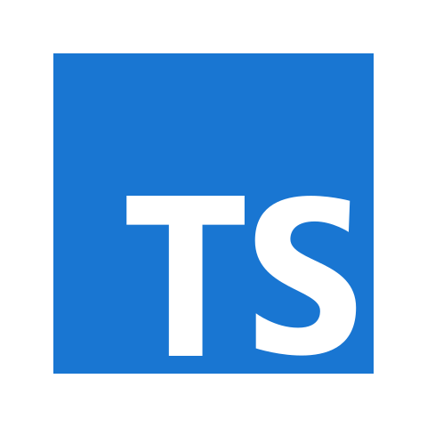

### Hi, i'm Gabriel 👋
---

I'm a web developer, currently working on designing websites with Vue and maintaining servers

Currently studying about Rust and its applications and in the open source contribution of the Rust community

## About me

* Languages

  
  
  
  
  
  
  
* Technologies
  
  
  
  
  
  
  
  
  
  
  

* Tools

  
  

<!-- * Projects

  
   -->

