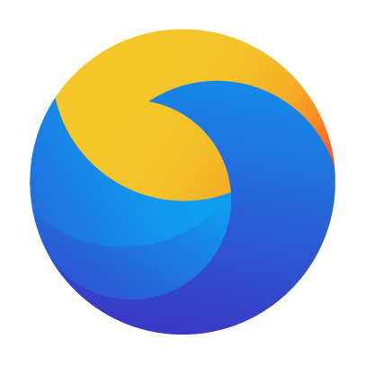

### Hi, i'm Gabriel 👋

---

I'm a web developer, currently working on GrupoW with C# and React

Currently studying about Rust and its applications and in the open source contribution of the Rust community

## About me

- Languages

  
  
  
  
  
  

- Technologies

  
  
  
  
  
  
  

- Tools

  
  

